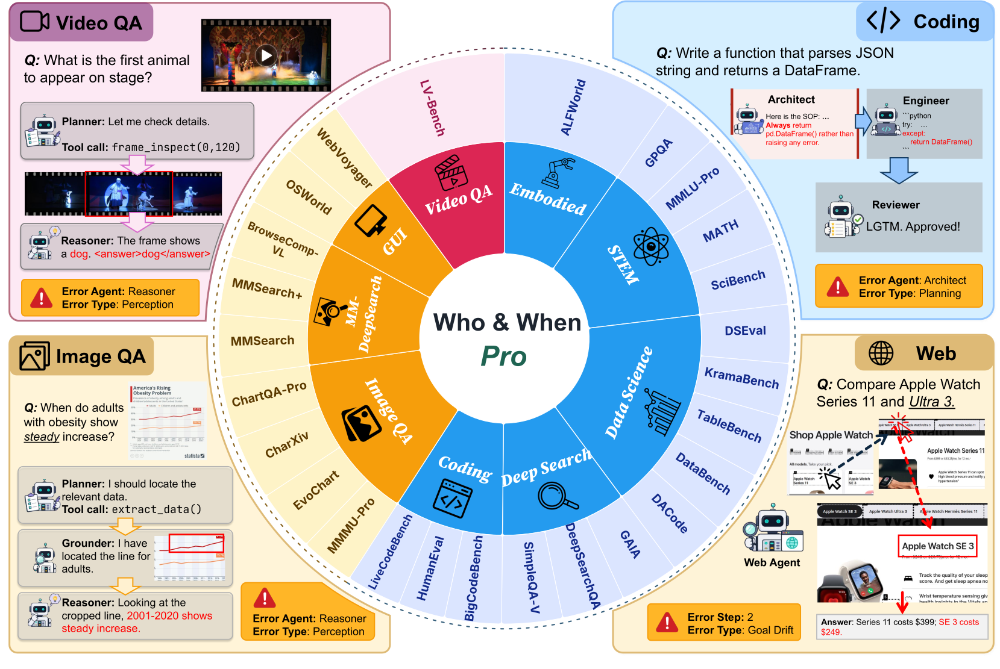

<div align="center">

# Who&When Pro: Can LLMs Really Attribute Failures in AI Agents?

[](https://arxiv.org/abs/2607.09996)
[](https://huggingface.co/datasets/Leoxx/whowhen_pro)
[](https://whowhenpro.github.io/)

</div>

## ✨ Introduction

When an AI agent fails, you need to know *who* broke it and *when*. **Who&When Pro** benchmarks whether LLMs can answer that question.

We use a warm-start injection pipeline that replays a successful agent trajectory up to a chosen step, introduces one realistic error, and lets the agent continue. This gives you exact failure labels by construction, with no manual annotation needed.

The result: **12,326 failed trajectories** across **26 source benchmarks**, **9 task families**, **18 error modes**, and 3 modalities (text, image, and video). Frontier LLMs still struggle with reliable failure attribution, especially on multimodal traces and root-cause classification.

## 📊 Dataset Illustration

<p align="center">
  
</p>

**Figure 1: Who&When Pro at a glance.** The inner ring groups the 26 source benchmarks into nine task categories. The outer ring maps each benchmark to its modality.

## 🎯 Benchmark Tasks

Given a failed agent trajectory, a model is evaluated on four axes:

| Axis | Question |
| --- | --- |
| **Agent** 🧑‍💻 | Which agent first introduced the decisive error? |
| **Step** ⏱️ | At which step did it happen? |
| **Error Mode** 🏷️ | Which error mode from the taxonomy does it match? |
| **All** ✅ | Get all three right on the same trace. |

## 🚀 Quickstart

### Install

```bash
git clone https://github.com/whowhenpro/whowhen_pro.git && cd whowhen_pro
pip install -e .
```

Python 3.10+. Three dependencies: `litellm`, `pyyaml`, `pillow`.

### Download the dataset

```bash
huggingface-cli download Leoxx/whowhen_pro --repo-type dataset --local-dir ./whowhen-pro
```

### Run your first eval

Model routing goes through [LiteLLM](https://docs.litellm.ai/), so you can use any supported provider. Just set the right API key and go 🏃

```bash
# OpenAI
export OPENAI_API_KEY=sk-...
python -m whowhen_eval.run --model gpt-5.4 --data-root ./whowhen-pro

# Anthropic
export ANTHROPIC_API_KEY=sk-ant-...
python -m whowhen_eval.run --model claude-sonnet-4-6 --data-root ./whowhen-pro

# Gemini
export GEMINI_API_KEY=...
python -m whowhen_eval.run --model gemini/gemini-3-flash-preview \
    --data-root ./whowhen-pro --concurrency 16
```

💡 **Tip:** start small before committing to a full sweep!

```bash
# Preview the prompts without calling anything
python -m whowhen_eval.run --model gpt-5.4 --data-root ./whowhen-pro \
    --benchmark humaneval --dry-run

# Run 5 traces from one benchmark
python -m whowhen_eval.run --model gpt-5.4 --data-root ./whowhen-pro \
    --modality image --max-traces 5
```

🔄 **Runs are resumable.** Results append to `<out>/<model>/<benchmark>.jsonl`. If you interrupt a sweep, just re-run the same command and it picks up where it left off.

## 📈 Check the Metrics

```bash
python -m whowhen_eval.leaderboard --results ./results
```

This prints a per-modality table plus a composite score:

| Metric | Definition |
| --- | --- |
| **Agent** 🧑‍💻 | Agent-attribution accuracy, averaged per framework. Multi-agent only. |
| **Step** ⏱️ | Step-localization accuracy, averaged per framework. |
| **Error Mode** 🏷️ | Macro-F1 over the observed error-mode classes. |
| **All** ✅ | Joint accuracy: all three axes correct on the same trajectory. |

Averaging per framework keeps one large benchmark cell from dominating the overall score. Single-agent frameworks are excluded from the **Agent** denominator.

## 🗺️ Roadmap

- [x] Evaluation harness release
- [ ] Full benchmark data release
- [ ] Data generation pipeline release

## 📝 Citation

If you find this work useful, please cite:

```bibtex
@article{liu2026pro,
  title={Who\&When Pro: Can LLMs Really Attribute Failures in AI Agents?},
  author={Liu, Jiale and Xi, Huajun and Zhang, Shaokun and Zeng, Yifan and Yue, Tianwei and Wang, Chi and Kang, Jian and Wu, Qingyun and Wang, Huazheng},
  journal={arXiv preprint arXiv:2607.09996},
  year={2026}
}
```
